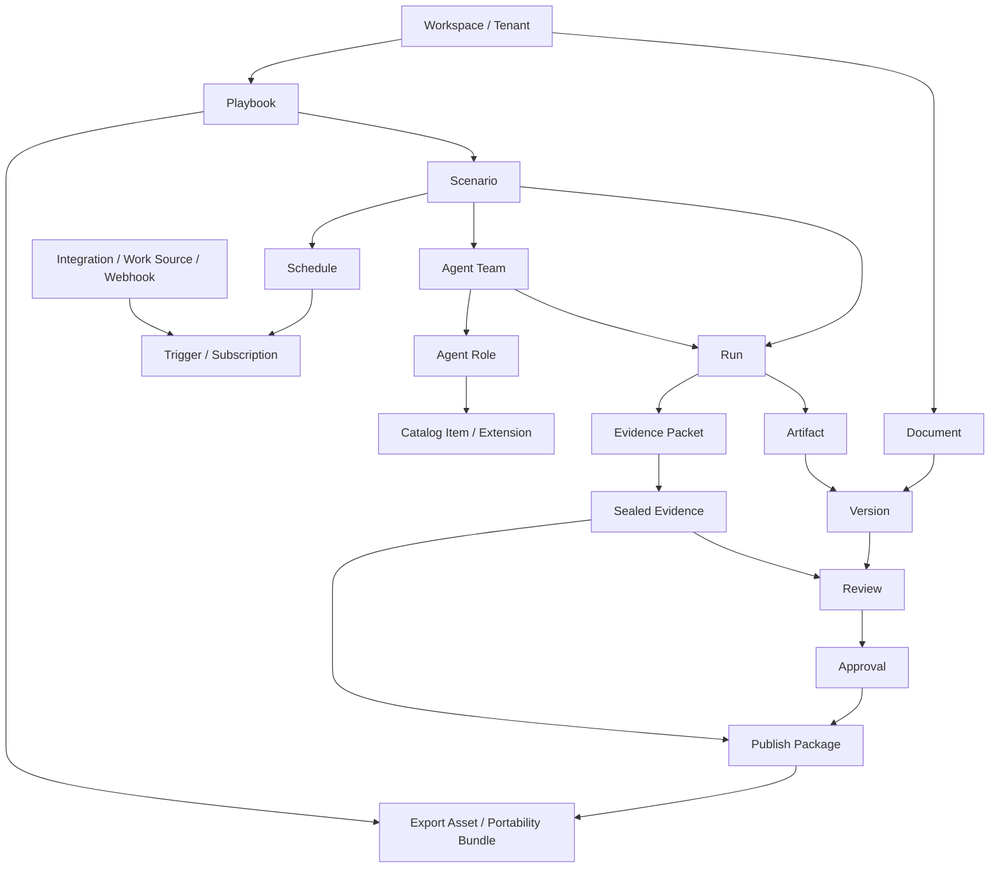

# Core Product Concepts

Pluto is a document-first, governance-first platform for AI-assisted work. Users
primarily manage governed content and decisions. Runtime sessions, provider
details, raw logs, and low-level storage remain backstage implementation detail.

## Concept glossary

### Workspace / Tenant boundary

A Workspace is the main product boundary for content, governance records,
integrations, schedules, catalog selections, runs, artifacts, and evidence. In a
production deployment, tenant and workspace identity must determine visibility,
authorization, storage partitioning, audit scope, and secret resolution. The
current implementation records `workspaceId` on many contracts but stores data in
local files, so it validates object boundaries without enforcing production
multi-tenant isolation.

### Document and Version

A Document is the primary user-facing content object. A Version is an immutable
or versioned snapshot of document content that can be reviewed, approved,
published, or linked to run provenance. Decisions should target a specific
Version, not a mutable document draft or raw artifact.

### Playbook

A Playbook is a reusable governed definition of work: goals, expected outputs,
team shape, catalog references, runtime requirements, and policies. It is the
user-facing unit for repeatable AI-assisted workflows. A Playbook can be exported
as a portable workflow definition, but platform-only state such as approvals,
credentials, run history, workspace bindings, and raw runtime state must stay out
of the portable core.

### Scenario

A Scenario is a concrete use case or variant under a Playbook. It narrows the
Playbook for a business context, input class, schedule, or trigger path. A
Scenario is usually what a user chooses when starting or scheduling a run.

### Agent Team

An Agent Team is the logical team configuration used by a Playbook or Scenario:
one lead role plus worker roles. In the current code, the default team has lead,
planner, generator, and evaluator roles. Product users should reason about the
team as a governed capability selection; runtime sessions and provider-specific
agent IDs remain backstage.

### Agent Role / Worker Contribution

An Agent Role defines a worker responsibility, prompt posture, and expected
evidence. Roles may reference catalog assets such as WorkerRole, SkillDefinition,
Template, PolicyPack, and SkillCatalogEntry versions. A Worker Contribution is
the recorded result from a role during a Run, including version pins for the
role, skill, template, policy pack, catalog entry, or extension install that
shaped the contribution.

### Run

A Run is an observable execution attempt for a Playbook/Scenario/Team against a
task and workspace. It records dispatch, worker progress, blockers, retries,
artifact creation, terminal status, and evidence finalization. Run detail is
supporting provenance, not the primary product home.

### Artifact

An Artifact is output produced by a Run, such as a generated markdown report or
other structured output. Artifacts support Documents, Versions, Reviews, and
Publish Packages, but they are not the final business delivery object. A user may
promote or incorporate artifact content into a Document Version.

### Evidence Packet / Sealed Evidence

An Evidence Packet is the governance-facing summary of a Run: status, blocker
reason, runtime result refs, worker contribution summaries, validation outcome,
cited inputs, risks, and open questions. Sealed Evidence is an immutable,
redacted, validated evidence packet suitable for review, approval, compliance,
and publish gates. Raw transcripts and provider diagnostics are backstage and
should not become foreground evidence.

### Review / Approval

A Review is a quality or suitability decision request for a Document, Version,
section, or Publish Package. An Approval is a distinct responsibility grant for a
Version or package. Review can request changes; Approval authorizes governed
progress. Both should cite precise targets and required evidence.

### Publish Package

A Publish Package assembles approved Version refs, sealed evidence refs, release
readiness refs, channel targets, export assets, publish attempts, and audit
events. It is the delivery object for publishing and compliance, not the raw
artifact. Packages should be superseded rather than silently mutating approved
history when sources, targets, approvals, or evidence change.

### Schedule / Trigger / Subscription

A Schedule binds a Playbook and Scenario to future execution intent. Triggers are
the concrete firing mechanisms, such as cron, manual, API, or event sources.
Subscriptions connect schedules to event streams or deliveries. In the current
code only selected trigger kinds are enabled locally; production needs durable
queues and webhook/event infrastructure.

### Integration / Work Source / Webhook

An Integration connects Pluto to external systems. A Work Source represents an
external source of incoming work; a Work Source Binding maps it into a workspace
target such as a document seed, playbook, or scenario. Inbound work items carry
provider refs, payload refs, dedupe keys, and provenance. Webhook subscriptions
and delivery attempts represent outbound or event delivery with signing,
idempotency, replay protection, retry state, and redacted payload summaries.

### Extension / Catalog item

The Catalog governs reusable capabilities: Worker Roles, Skills, Templates,
Policy Packs, and Skill Catalog Entries. An Extension is an installable package
that can contribute skills, templates, or policies and declare compatibility,
capabilities, secrets, tool surfaces, sensitivity, and outbound-write claims.
Catalog and extension assets require review/trust checks before activation; they
are internal capability governance, not the foreground content model.

### Portability bundle

A Portability Bundle exports safe, portable assets such as documents, templates,
publish-package summaries, evidence summaries, or portable workflow bundles. It
uses logical references, compatibility metadata, checksums, import requirements,
and redaction summaries. It must exclude tenant-private state, raw runtime
payloads, credentials, provider sessions, private storage paths, and workspace
bindings.

## Relationship diagram

## Foreground vs backstage objects

Foreground objects are the objects users govern and make decisions about:
Workspace, Document, Version, Review, Approval, Publish Package, Playbook,
Scenario, Schedule, Catalog selection, Integration binding, and the observable Run
summary.

Backstage objects support execution and auditability: runtime adapters, provider
profiles, provider sessions, raw callbacks, low-level event logs, raw transcripts,
storage paths, payload envelopes, queues, retry internals, and unredacted
diagnostics. They may be inspected by operators, but they should not become the
default subject of document, review, approval, or publish workflows.

## Ownership and source-of-truth rules

- Document is the primary product home. Version is the source of truth for review,
  approval, and publish decisions.
- Playbook and Scenario are the source of truth for repeatable work intent.
- Agent Team and Agent Roles are governed execution definitions. Runtime sessions
  are internal instances, not product subjects.
- Run is the source of truth for execution occurrence and status. It does not, by
  itself, redefine a Document or Version state.
- Artifact is supporting output. A Publish Package, not an Artifact, is the source
  of truth for delivery.
- Evidence Packet is the source of truth for run provenance. Sealed Evidence is
  the immutable review/publish-ready form.
- Review and Approval are separate decision records with explicit targets.
- Schedule, Trigger, and Subscription own recurring and inbound execution intent;
  they should not embed secret values.
- Integration records own provider-neutral source/target refs, dedupe, signing,
  idempotency, and redacted payload summaries; raw provider payloads stay private.
- Catalog items and Extensions own reusable capability versions and activation
  status; runtime capability matching still happens at dispatch time.
- Portability bundles own export/import transfer semantics, not platform state.

## Lifecycle examples

### 1. Document-first authoring and review

1. A user creates or imports a Document in a Workspace.
2. The user creates a Version from the current content.
3. The user requests Review for that Version and attaches evidence requirements.
4. Reviewers comment, request changes, or mark the review succeeded.
5. If the Version needs authorization, an Approval request targets the same
   Version and records a separate decision.

### 2. Playbook-driven agent team run

1. A user selects a Playbook and Scenario from a Document or workflow context.
2. Pluto resolves the Agent Team, role catalog pins, runtime requirements, and
   policy constraints.
3. Runtime selection fails closed if hard requirements are not met.
4. The lead dispatches worker roles; worker contributions are recorded with
   catalog provenance.
5. The Run creates an Artifact and Evidence Packet. Redacted, validated evidence
   can be sealed and linked back to a Version, Review, or Publish Package.

### 3. Scheduled or inbound trigger to run

1. A Schedule references a Playbook, Scenario, owner, triggers, and subscriptions.
2. A cron/manual/API/event Trigger fires, or an Integration receives an inbound
   work item from a Work Source/Webhook.
3. Pluto validates workspace, signature/credential refs, dedupe keys, filters,
   and target bindings.
4. The accepted trigger enqueues or starts a Run; blocked or missed runs record
   diagnosable reasons.

### 4. Publish, compliance, and export path

1. A Publish Package selects approved Version refs, sealed evidence refs, release
   readiness refs, and channel targets.
2. Readiness blocks on missing approvals, missing sealed evidence, failed gates,
   duplicate idempotency keys, or credential leakage.
3. Export assets are produced with redaction summaries, checksums, and channel
   target refs.
4. Publish attempts and rollback/retract/supersede events create audit records.
5. Portability bundles can export safe summaries and portable definitions while
   excluding platform-private and runtime-private state.

## Current local file-backed skeleton vs production persistence

The current repository is intentionally local-first and file-backed. It validates
contract shapes, orchestration semantics, provenance, redaction boundaries,
readiness gates, and CLI flows. It is useful for product-shape hardening and
offline tests.

It is not yet production persistence. Production must add a transactional store,
migrations, tenant-aware authorization enforcement, durable queues, webhook/event
delivery infrastructure, secret resolution, observability backends, retention and
legal-hold controls, and operational recovery semantics. The product concepts in
this document should remain stable across that persistence change.
