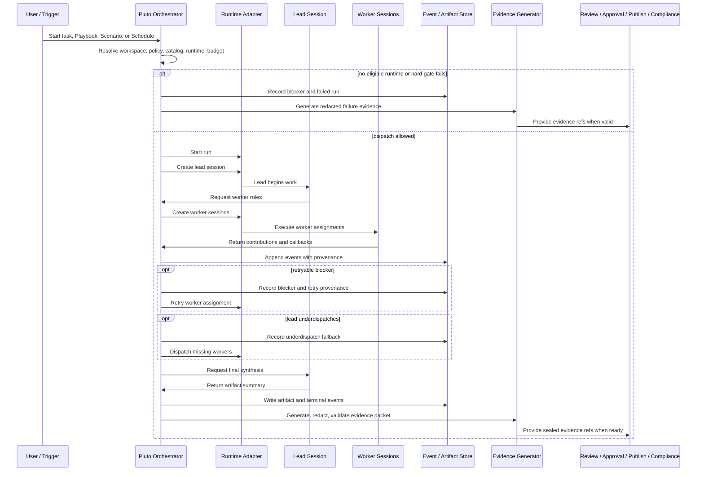

# Runtime and Evidence Flow

Pluto execution becomes governable only when runtime activity is transformed
into redacted, validated, referenceable evidence. A final artifact alone is not
enough: review, approval, publishing, compliance, and observability need to know
what ran, which workers contributed, which blockers occurred, what validation
said, and which records are safe to inspect.

## Run lifecycle

1. A user or trigger starts work from a task, Playbook, Scenario, or Schedule.
2. Pluto resolves workspace scope, team shape, runtime requirements, catalog
   pins, policy constraints, and budget or eligibility gates.
3. The team lead session starts through an eligible Adapter.
4. The lead requests worker roles such as planner, generator, and evaluator.
5. Workers produce contributions. Each contribution carries role/session
   identity and, when available, catalog provenance such as worker role, skill,
   template, policy pack, catalog entry, or extension install refs.
6. The lead synthesizes a final artifact after required worker contributions are
   available.
7. Pluto records artifact creation, terminal status, blockers, retries, and
   evidence generation results in the run event log.
8. Pluto generates an Evidence Packet from the normalized event stream and
   artifact/contribution records.

## Agent team dispatch and provenance

The team model separates logical worker responsibilities from provider sessions.
Users should reason about the lead and workers as governed roles. Provider
session identifiers remain backstage diagnostics.

Worker contribution provenance answers:

- which role contributed;
- which runtime session produced the contribution;
- which catalog-pinned role, skill, template, policy pack, catalog entry, or
  extension shaped the contribution;
- which validation result, risks, or open questions were derived from the run.

This provenance supports review and publishing without requiring consumers to
read raw transcripts or provider-specific callback payloads.

## Blockers, retries, and underdispatch

Runtime failures are normalized into a canonical blocker taxonomy rather than
leaking provider-specific errors into governance decisions. Conceptually,
blockers include provider unavailability, missing credentials, quota exhaustion,
capability mismatch, runtime permission denial, timeout, empty artifact,
validation failure, adapter protocol error, runtime error, and unknown failure.

Retries must preserve provenance. A retry is not just an attempt number; it
should point back to the blocker or failure event that justified the retry. This
keeps the evidence chain reconstructable.

Underdispatch fallback is a guard against a lead that fails to request enough
workers. At the conceptual level, Pluto records that fallback occurred, which
roles were missing, and which roles were dispatched by the orchestrator. This
keeps successful completion auditable even when the lead did not initiate every
worker assignment.

## Artifact, Evidence Packet, and Sealed Evidence

| Object | Meaning | Governance role |
|---|---|---|
| Artifact | Output produced by a Run, such as markdown or another structured asset. | Supporting output that can be promoted into or linked from a Document Version or Publish Package. |
| Evidence Packet | Governance-facing summary of a Run: status, blocker reason, runtime result refs, worker summaries, validation, cited inputs, risks, and open questions. | Review and publish input after validation and redaction. |
| Sealed Evidence | Immutable, redacted, validated evidence packet with stable refs. | Decision-grade record for Review, Approval, Publish Package, Compliance, and audit export. |

Artifacts can be useful but are not sufficient for governed decisions. Evidence
Packets explain how an artifact was produced and whether it is safe to use.
Sealed Evidence is the decision-ready form.

## Redaction boundary

Raw provider payloads, transcripts, stderr, callback credentials, private file
paths, endpoints, and session diagnostics stay backstage. They may be needed for
operator debugging, but they should not become default foreground evidence.

The governance boundary is crossed only after normalization, redaction,
classification, and validation. Foreground consumers should receive summaries,
refs, readiness flags, and redacted previews rather than raw provider state.

This protects secrets and reduces evidence noise. It also keeps Review,
Approval, Publish, Compliance, and Portability independent from a specific
runtime provider.

## Downstream consumers

Evidence feeds multiple product surfaces:

- **Review:** verifies whether generated work has review-ready evidence, cited
  inputs, validation outcome, risks, and open questions.
- **Approval:** records which evidence snapshot supported authorization.
- **Publish:** blocks or allows package readiness based on approvals, sealed
  evidence, release readiness, and channel gates.
- **Compliance:** links sealed evidence to retention, legal hold, deletion
  decisions, audit exports, and regulated publish decisions.
- **Observability:** summarizes run health, adapter health, budget decisions,
  redacted traces, metrics, and alerts.

## Sequence diagram

